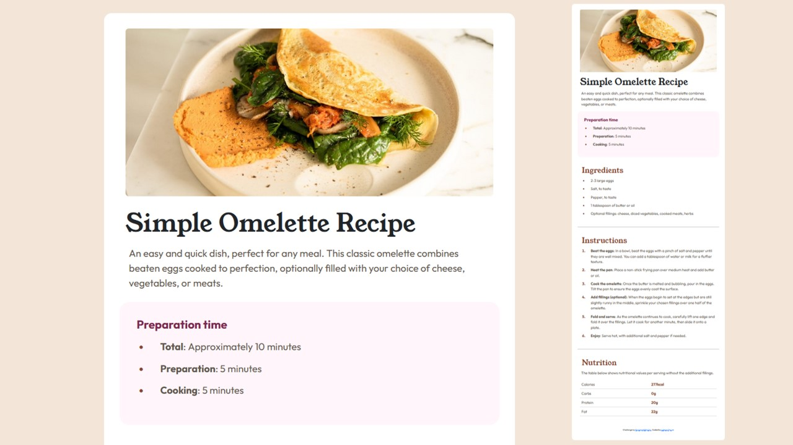

# Responsive-Recipe-Page
Responsive Recipe Page using HTML, CSS and Bootstrap

## Frontend Mentor - Recipe page solution

This is a solution to the [Recipe page challenge on Frontend Mentor](https://www.frontendmentor.io/challenges/recipe-page-KiTsR8QQKm).

## Table of contents

- [Overview](#overview)
  - [Screenshot](#screenshot)
  - [Links](#links)
- [My process](#my-process)
  - [Built with](#built-with)
  - [Fonts](#fonts)
  - [Colors](#colors)
- [Author](#author)

## Overview

### Screenshot

### Links

- Solution URL: [Add solution URL here](https://your-solution-url.com)
- Live Site URL: [Add live site URL here](https://lilitr09.github.io/Responsive-Recipe-Page/)

## My process

### Built with

- Semantic HTML5 markup
- CSS custom properties
- Flexbox
- [Bootstrap](https://getbootstrap.com/) - HTML, CSS and JS library

### Fonts

- Family: [Young Serif](https://fonts.google.com/specimen/Young+Serif)
- Weights: 400

- Family: [Outfit](https://fonts.google.com/specimen/Outfit)
- Weights: 400, 600, 700

## Colors

- White: hsl(0, 0%, 100%)
- Stone 150: hsl(30, 18%, 87%)
- Stone 600: hsl(30, 10%, 34%)
- Brown 800: hsl(14, 45%, 36%)
- Rose 800: hsl(332, 51%, 32%)
- Rose 50: hsl(330, 100%, 98%)

## Author

- Frontend Mentor - [@Lilitr09](https://www.frontendmentor.io/profile/Lilitr09)

